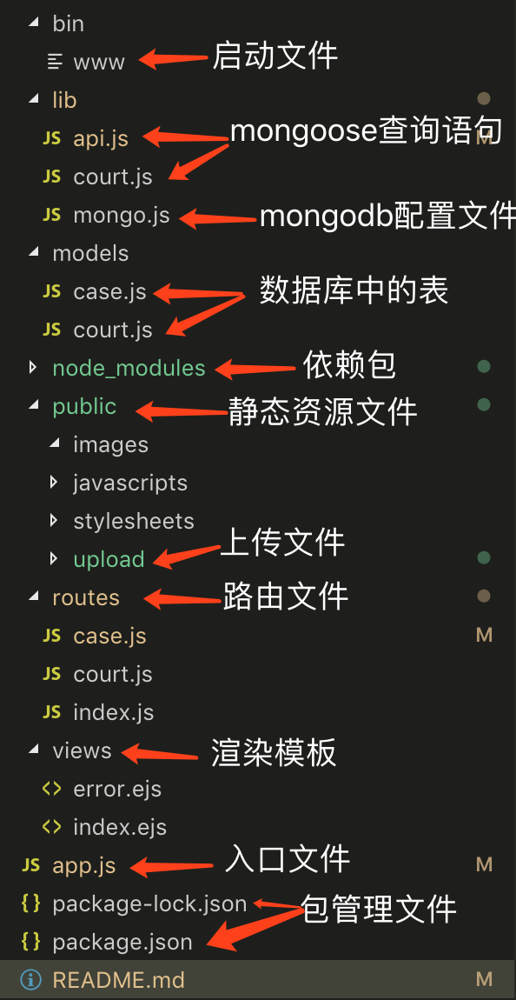

# node-express-mongod
node-express-mongod 是基于[express](http://http://www.expressjs.com.cn/)框架搭建的一个服务。

## 开发环境和技术栈

版本号均为截至上传日期最新稳定版。

1.  async: `^2.6.1`
2.  connect-mongo: `^2.0.3`
3.  cookie-parser: `~1.4.3`
4.  debug: `~2.6.9`
5.  ejs: `~2.5.7`
6.  express: `~4.16.0`
7.  http-errors: `~1.6.2`
8.  mongodb: `^3.1.10`
9.  mongoose: `^5.4.0`
10. mongoose-auto-increment: `^5.0.1`
11. morgan: `~1.9.0`
12. multer: `^1.4.1`

## 目录结构


## 安装

```
# 克隆项目
git clone http://129.1.50.194:9999/gitlab/web-front-end/node-express-mongod.git

# 安装依赖
npm install

# 本地开发 启动项目
1. 在 MacOS 或 Linux 中，通过如下命令启动此应用：
$ DEBUG=myapp:* npm start

2. 在 Windows 中，通过如下命令启动此应用：
> set DEBUG=myapp:* & npm start


```

## 功能

- [增删改查](#增删改查)
- [文件上传](#文件上传)

### 增删改查
在成功链接数据库，创建完表之后
1. 新增：
配置新增的接口,通过request对象的请求体拿到，需要保存的数据，做为参数,传到model的save方法中，调用mongoose的save方法完成保存到数据库的过程。
2. 修改：
配置同样的路由，使用put的请求方法，mongoose的update方法接受两个参数，第一个为需要根据某个条件进行数据更新，第二个参数为需要更新的数据对象。
3. 查询：
同样的路由，使用get的请求方式，
需要调用mongoose的find方法，接受三个参数，第一个为需要进行查询的筛选条件，第二个为，需要查询的字段，如果为空则返回全部字段，第三个参数为配置选项。
4. 删除
同样的路由，使用delete的请求方式，
需要调用mongoose的remove方法，只需传递一个删除条件。

### 文件上传
引入第三方插件[multer](http://https://github.com/expressjs/multer/blob/master/doc/README-zh-cn.md)，multer方法接受一个参数对象，对象里必须配置storage：文件存储的位置
可选配项：
1. fileFilter：文件过滤器，控制哪些文件可以被接受
2. limits： 限制上传的数据
3. preservePath：保存包含文件名的完整文件路径
配置完之后,调用multer方法返回一个对象，可调用的方法有：
1. upload.single('avatar') 单个文件的上传,括号里的字符串参数需要与input的name对应
2.  upload.array('photos', 12) 上传一组文件
3. upload.fields([{ name: 'avatar', maxCount: 1 }, { name: 'gallery', maxCount: 8 }]) 上传多个不同类型的文件

